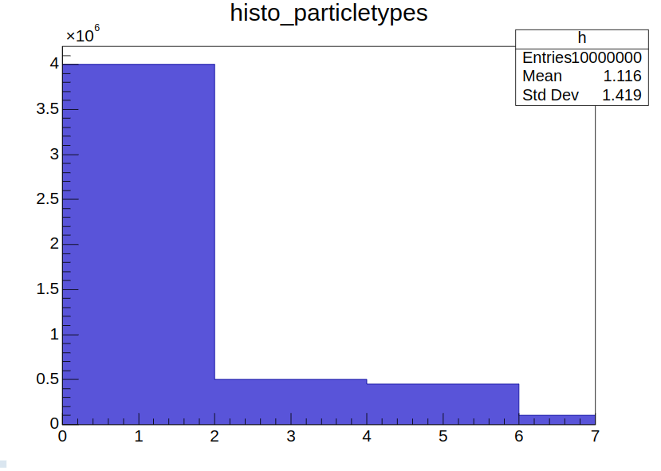
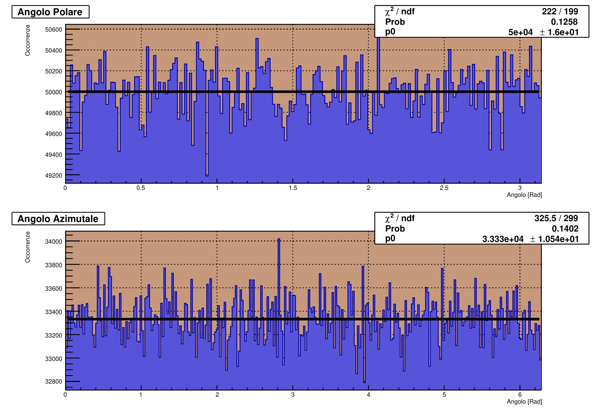
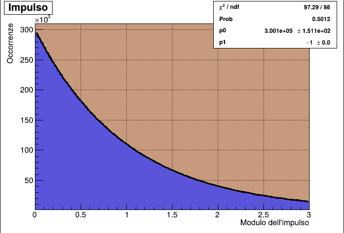
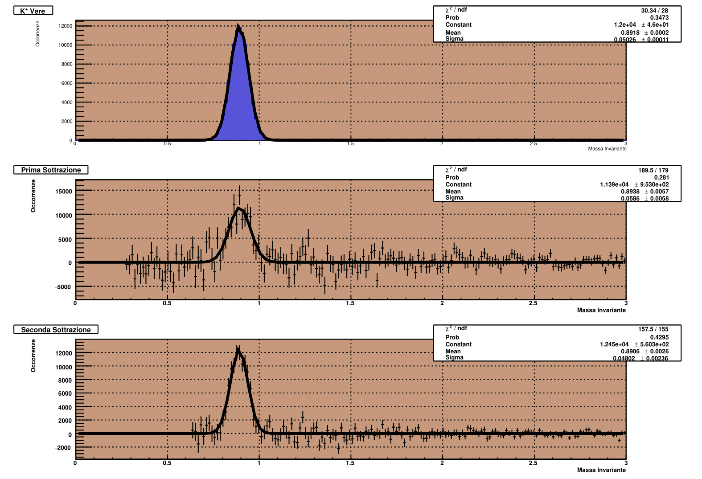

# Simulazione del Decadimento della Particella K^0*

**Autori**: Malagoli Tommaso Andrea, Mazzi Davide, Pivi Riccardo, Schirripa Mattia  
**Data**: Novembre 2024  

## Introduzione

Questo progetto simula eventi fisici risultanti da collisioni di particelle elementari.  
Il codice, scritto in C++, utilizza la libreria ROOT per analisi dati e generazione di grafici.  

Consultare la relazione in formato pdf inclusa nella repository per dettagli tecnici sul codice e i risultati della simulazione.

## Struttura del Codice

Il programma implementa tre classi principali:  

1. **ParticleType**  
   - Proprietà: massa, carica e nome delle particelle elementari.  

2. **ResonanceType**  
   - Estensione di `ParticleType`, include la larghezza di risonanza.  

3. **Particle**  
   - Gestisce quantità di moto e include un array di puntatori a `ParticleType`.  

### Gerarchia delle Classi

- **ResonanceType** eredita da `ParticleType` sovrascrivendo il metodo `Print()`.  
- **Particle** utilizza un array di puntatori a `ParticleType` (relazione *has-a*).  

### Principali Metodi Implementati

- `FindParticle`: Ritorna l'indice del tipo di particella.  
- `PrintParticle`: Mostra le informazioni di una particella.  
- `TotalEnergy`: Calcola l'energia totale (formula relativistica).  
- `InvMass`: Ritorna la massa invariante.  
- `Decay2body`: Gestisce il decadimento di una particella `K^0*` in due particelle figlie.

## Generazione degli Eventi

La simulazione genera 10^5 eventi con almeno 100 particelle per evento.  
Le particelle vengono distribuite in base alle probabilità seguenti:  

| Particella | Probabilità (%) |
|------------|-----------------|
| π⁺: indice 0   | 40             |
| π⁻: indice 1        | 40             |
| k⁺: indice 2      | 5              |
| k⁻: indice 3      | 5              |
| p⁺: indice 4        | 4.5            |
| p⁻: indice 5       | 4.5            |
| K^0*: indice 6     | 1              |



## Analisi dei Risultati

L'analisi dei dati è stata eseguita utilizzando ROOT, generando istogrammi e grafici per verificare la compatibilità tra i dati teorici e la simulazione.

- **Istogrammi principali**:
  - Distribuzione angoli (polari e azimutali).

  - Distribuzione quantità di moto.

  - Sottrazione masse invarianti.

## Come Eseguire il Progetto

1. Clona questo repository e assicurati di avere installato ROOT.  
2. Assicurati che il file `compile.sh` abbia i permessi di esecuzione:
   ```bash
   chmod +x compile.sh
3. Per compilare (questo comando aprirà anche ROOT):
   ```bash
   ./compile.sh
4. Per eseguire la generazione:
   ```bash
   main_module();
5. Per eseguire l'analisi:
   ```bash
   macro_analysis();
